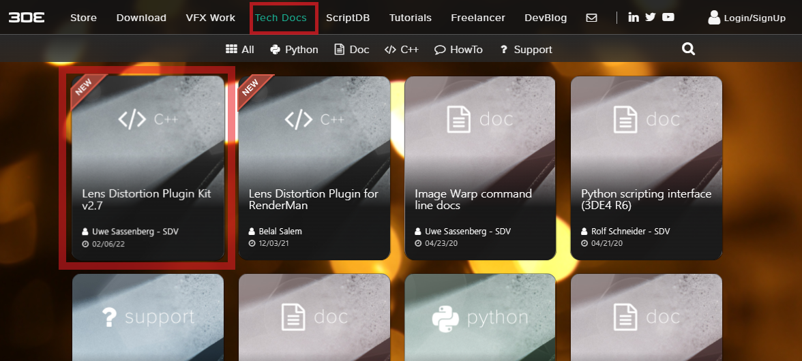
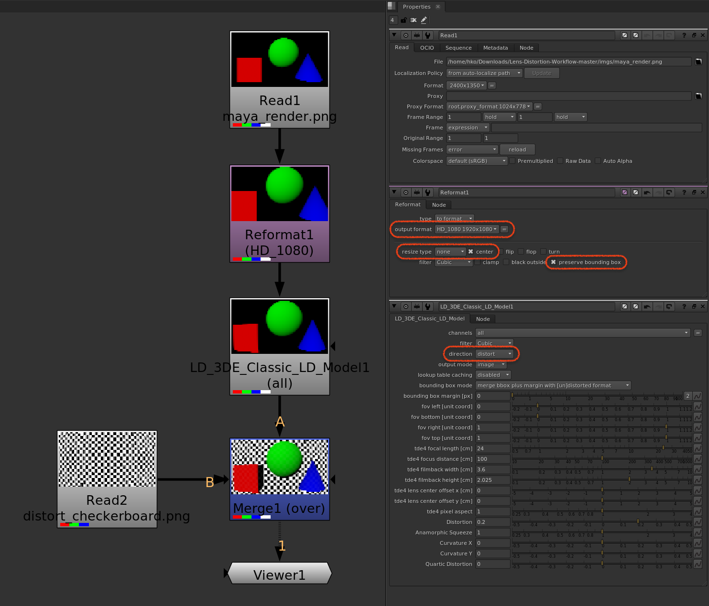

# 3DEqualizer to Nuke - Lens Distortion Workflow

## Overview

### Methods

- 3DEqualizer에서는 세 가지 워크플로우를 제공하고 있다. [참고영상](https://www.youtube.com/watch?v=khMwtfmynac).
- 회사에 실정에 맞는 워크플로우를 선택하면 된다.
- 프로덕션에서는 `LDPK`나 `STMAP`을 주로 사용한다.

| 방법 | 장점 | 단점 |
| :---: | :---: | :---: |
| Grid Warp | `설치가 필요없다` `빠르다` | `해상도에 종속된다` |
| LDPK | `사용법이 간단하다` `해상도에 종속되지 않는다` | `느리다` `설치가 필요하다` |
| STMAP | `매우 빠르다` | `파일 용량이 크다` |

### Workflow

```
Original Plate Size: 1920 x 1080
Overscan Value: 1.25
Undistort Plate Size: 2400 x 1350
Render Image Size: 2400 x 1350
```

1. 3DEqualizer에서 Original Plate(1920 x 1080)로 트래킹 작업한다.
1. 3DEqualizer에서 Warp4 플러그인을 사용해서 Undistort Plate(2400 x 1350)를 생성한다.
    - `Original Plate Size` x `Overscan Value` = `Undistort Plate Size`
    - `1920 x 1.25 = 2400` `1080 x 1.25 = 1350`
1. **Maya에서 Render Image Size는 Undistort Plate Size와 동일해야 한다.** :warning:**매우 중요**:warning:
1. 

## Lens Distortion Plugin Kit(LDPK)

### Download

1. 3DEqualizer 공식 홈페이지 Tech Docs 접속. [링크](https://www.3dequalizer.com/index.php?site=tech_docs).

1. Lens Distortion Plugin Kit vX.X 카드 클릭.

    

1. Lens Distortion Plugin Kit vX.X 다운로드 링크 클릭.

    

### Install

1. `ldpk 경로`에 있는 플러그인 파일(`*.dll` `*.dylib` `*.so`)들을 복사 <kbd>ctrl+c</kbd> (필수)
2. `뉴크 plugins 경로`에 붙여넣기 <kbd>ctrl+v</kbd> (필수)

```
<참고>
리눅스에서는 윈도우나 맥에서 처럼 복사 붙여넣기가 안된다.
Root 권한으로 cp 명령어를 통해 파일들을 복사 붙여넣기 할 수 있다.
```

- Windows
    - ldpk 경로: `<path_to_dir>\ldpk-X.X\compiled\nuke\windows\<version>\*.dll`
    - 뉴크 plugins 경로: `C:\Program Files\<version>\plugins`

- MacOS
    - ldpk 경로: `<path_to_dir>/ldpk-X.X/compiled/nuke/osx/<version>/*.dylib`
    - 뉴크 plugins 경로: `/Applications/<version>/<version>.app/Contents/MacOS/plugins`

- Linux (CentOS 7.6)
    - ldpk 경로: `<path_to_dir>/ldpk-X.X/compiled/nuke/linux/<version>/*.so`
    - 뉴크 plugins 경로: `/usr/local/<version>/plugins`
    


3. 노드 메뉴에 등록하기 (선택)

    - `뉴크 plugins 경로` 안에 있는 `menu.py` 파일에 아래 코드 추가하기

```
nuke.menu("Nodes").addCommand("3DE4/LD_3DE4_Anamorphic_Standard_Degree_4", "nuke.createNode('LD_3DE4_Anamorphic_Standard_Degree_4')")
nuke.menu("Nodes").addCommand("3DE4/LD_3DE4_Anamorphic_Rescaled_Degree_4", "nuke.createNode('LD_3DE4_Anamorphic_Rescaled_Degree_4')")
nuke.menu("Nodes").addCommand("3DE4/LD_3DE4_Anamorphic_Degree_6", "nuke.createNode('LD_3DE4_Anamorphic_Degree_6')")
nuke.menu("Nodes").addCommand("3DE4/LD_3DE4_Radial_Standard_Degree_4", "nuke.createNode('LD_3DE4_Radial_Standard_Degree_4')")
nuke.menu("Nodes").addCommand("3DE4/LD_3DE4_Radial_Fisheye_Degree_8", "nuke.createNode('LD_3DE4_Radial_Fisheye_Degree_8')")
nuke.menu("Nodes").addCommand("3DE4/LD_3DE_Classic_LD_Model", "nuke.createNode('LD_3DE_Classic_LD_Model')")
```


---

### Export Lens Distortion Node


---

### Distort Render Elements

#### Node Tree



1. Read Node
    - Render Image Size: 2400 x 1350
    
    

1. Reformat Node
    - output format: <original plate size>
    - resize type: <kbd>none</kbd>  <kbd>x</kbd>center


1. LDPK Node
    - direction: <kbd>distort</kbd>

1. Merge Node
    - Merge with `Original Plate``
