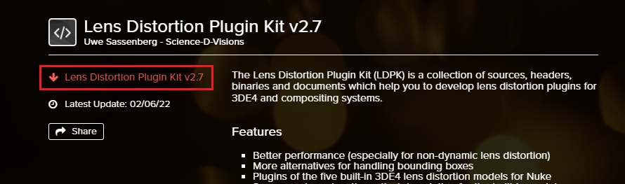

# 3DEqualizer to Nuke - Lens Distortion Workflow

- 3DEqualizer에서는 세 가지 워크플로우를 제공하고 있다. [참고영상](https://www.youtube.com/watch?v=khMwtfmynac).
- 회사에 실정에 맞는 워크플로우를 선택하면 된다.
- 프로덕션에서는 주로 `LDPK`나 `STMAP`을 주로 사용한다.

| 방법 | 장점 | 단점 |
| :---: | :---: | :---: |
| Grid Warp | `설치가 필요없다` `빠르다` | `해상도에 종속된다` |
| LDPK | `사용법이 간단하다` `해상도에 종속되지 않는다` | `느리다` `설치가 필요하다` |
| STMAP | `매우 빠르다` | `파일 용량이 크다` |

## Lens Distortion Plugin Kit(LDPK)

### Download

1. 3DEqualizer 공식 홈페이지 Tech Docs 접속. [링크](https://www.3dequalizer.com/index.php?site=tech_docs).

1. Lens Distortion Plugin Kit vX.X 카드 클릭.
    

1. Lens Distortion Plugin Kit vX.X 다운로드 링크 클릭.
    

### Install

1. `ldpk 경로`에 있는 플러그인 파일(`*.dll` `*.dylib` `*.so`)들을 복사 <kbd>ctrl+c</kbd>
2. `뉴크 plugins 경로`에 붙여넣기 <kbd>ctrl+v</kbd>. 리눅스에서는 Root 권한이 필요하다.

- Windows
    - ldpk 경로: `<path_to_dir>\ldpk-X.X\compiled\nuke\windows\<version>\*.dll`
    - 뉴크 plugins 경로: `C:\Program Files\<version>\plugins`

- MacOS
    - ldpk 경로: `<path_to_dir>/ldpk-X.X/compiled/nuke/osx/<version>/*.dylib`
    - 뉴크 plugins 경로: `/Applications/<version>/<version>.app/Contents/MacOS/plugins`

- Linux (CentOS 7.6)
    - ldpk 경로: `<path_to_dir>/ldpk-X.X/compiled/nuke/linux/<version>/*.so`
    - 뉴크 plugins 경로: `/usr/local/<version>/plugins`

<Example>
    

---

### Create

---

### Node Tree
