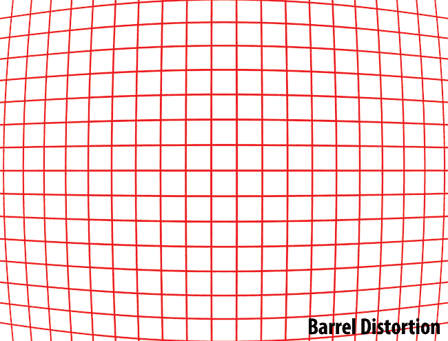

# Lens Distortion Workflow

## Lens Distortion
1. What is **Lens Distortion**

1. Type
    1. Radial Distortion - 방사왜곡
        - 방사왜곡은 볼록렌즈의 굴절률에 의한 것으로서 아래 그림과 같이 영상의 왜곡 정도가 중심에서의 거리에 의해 결정되는 왜곡
        1. Barrel Distortion
            
             
            
        2. Pincushion Distortion
        
             
            
        3. Moustache/Complex Distortion
        
            
        
    1. Tangential - 접선왜곡
        - 접선왜곡(tangential distortion)은 카메라 제조(조립) 과정에서 카메라 렌즈와 이미지센서(CCD, CMOS)의 수평이 맞지 않거나 또는 렌즈 자체의 centering이 맞지 않아서 발생하는 왜곡

1. Fix
    1. Grid Shot
    1. Parameter Adjustment
        - Grid Shot을 솔브하는 것 만큼 정확하지는 않지만, (정확한)2D Point가 풍부하면 어느정도 신용할 수 있는 결과가 나온다.
        - 단순히 최소 애러값을 찾는 방식이기 떄문에, 결과값을 100% 신용하면 안된다.

## 3DEqualizer
1. Export Undistorted/Dewarped Plates
1. Export Nuke LD_3DE4 Lens Distortion Node
1. Export Project to Maya

## Maya

### Setup
1. Import 3DE Project
1. Overscan
    1. Film Aperture
    1. Image Plane

### Render
1. Render Settings
    1. Image Size = Undistorted/Dewarped Plate Size

## Nuke

### Install

### Redistort/Distort Node Tree

---

# References

_ [How Lenses Function](https://youtu.be/EL9J3Km6wxI)
- [How Canon EF Lenses Are Made](https://youtu.be/59BfFQuX1rg)
- [다크 프로그래머 :: 카메라 왜곡보정 - 이론 및 실제](https://darkpgmr.tistory.com/31)
- [What is Distortion? - Photography Life](https://photographylife.com/what-is-distortion)
- [Distortion | 에드몬드 옵틱스 - Edmund Optics](https://www.edmundoptics.co.kr/resources/application-notes/imaging/distortion/)
