# Lens Distortion Workflow

## Lens Distortion
1. What is **Lens Distortion**

    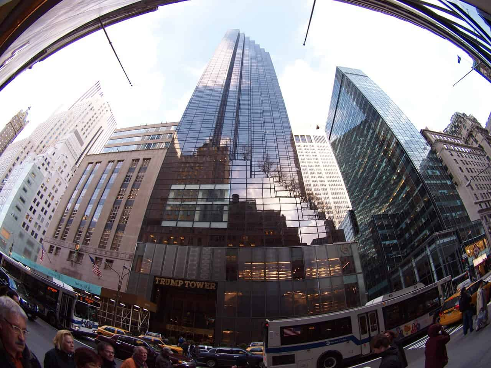 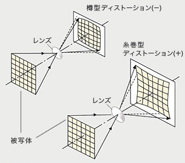
    
    일반적으로, 휴대폰에 내장된 카메라 등과 같은 디지털 카메라는 렌즈와 이 렌즈를 통해 입사되는 영상을 검출하는 CCD 또는 CMOS와 같은 이미지 센서로 이루어진다. 상기 렌즈를 투과한 영상은 렌즈 자체가 갖는 여러가지 광학적 특성으로 인해 실제 육안으로 보이는 영상과 여러가지 면에서 차이가 있다. 육안으로 보이는 영상과 렌즈를 통과하여 이미지 센서에 검출된 영상의 차이점을 렌즈 수차라고 하며, 렌즈의 설계, 제작 시 렌즈 수차를 제거하여 육안으로 보이는 것과 실질적으로 동일한 영상을 얻고자하는데 많은 연구가 이루어지고 있는 실정이다.
    
    상기 렌즈 수차에는 여러가지 종류가 있으며, 특히 렌즈와 센서의 기하학적 형태 차이 또는 렌즈의 굴곡에 의해 발생하는 렌즈의 왜곡 수차(이하, "렌즈의 왜곡" 또는 "렌즈 왜곡"이라 함)는 육안으로 보기에 직선으로 보이는 영상이 렌즈를 통과한 후 곡선으로 나타내는 렌즈의 수차를 의미한다.
    
    - Optical Distortion라고도 함.
    - Perspective Distortion하고 혼동하면 안된다.

1. Type
    1. Radial Distortion - 방사왜곡
        - 방사왜곡은 볼록렌즈의 굴절률에 의한 것으로서 아래 그림과 같이 영상의 왜곡 정도가 중심에서의 거리에 의해 결정되는 왜곡
        1. Barrel Distortion
            
             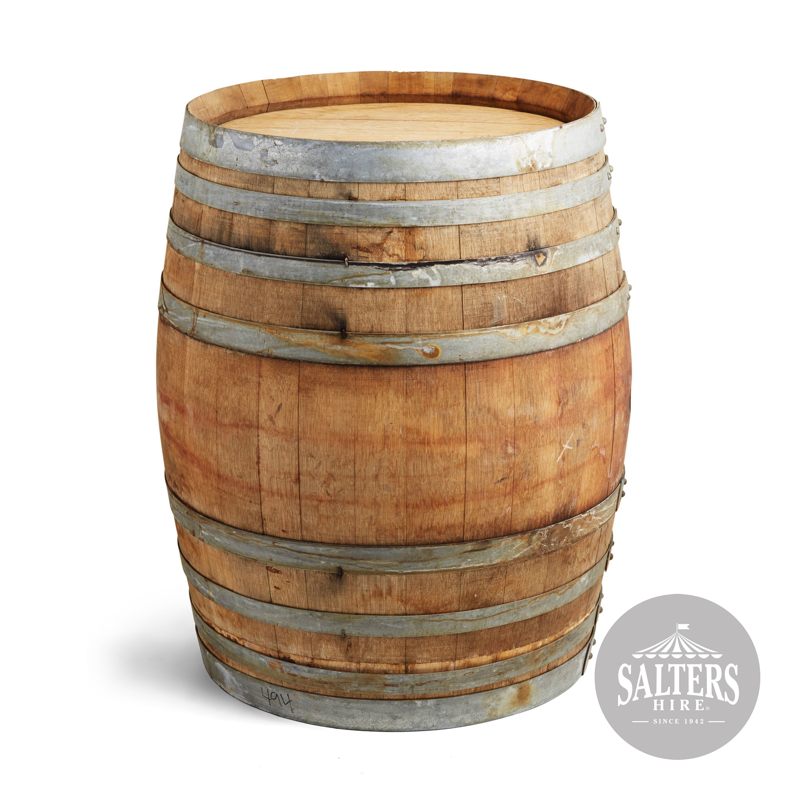
            
        2. Pincushion Distortion
        
            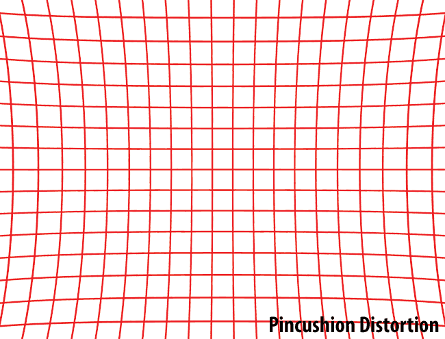 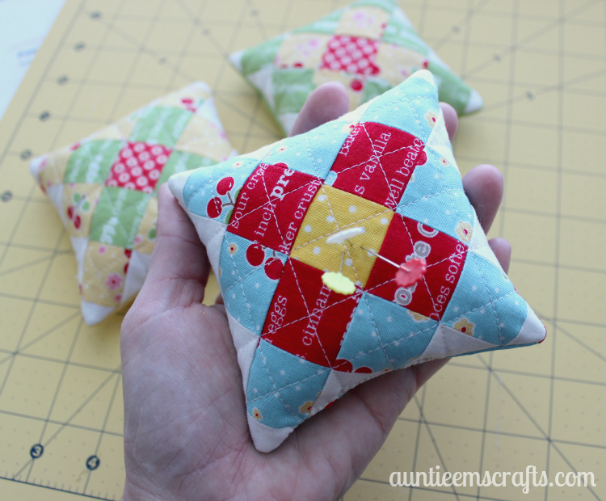
            
        3. Moustache/Complex Distortion
        
            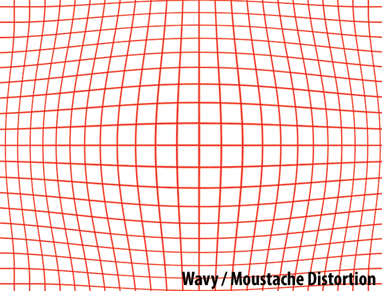
        
    1. Tangential - 접선왜곡
        - 접선왜곡(tangential distortion)은 카메라 제조(조립) 과정에서 카메라 렌즈와 이미지센서(CCD, CMOS)의 수평이 맞지 않거나 또는 렌즈 자체의 centering이 맞지 않아서 발생하는 왜곡

1. Problem
    - 렌즈왜곡을 보정하지 않으면 솔브가 제대로 되지않는다.
    - 참고로 모든 렌즈에는 왜곡이 존재한다. 많고 적음의 차이지 없을 순 없다. 왜곡이 별로 없으면 그냥 무시하고 솔브하기도 한다.

1. Fix
    1. Lens Distortion Grid
        - Good
        
            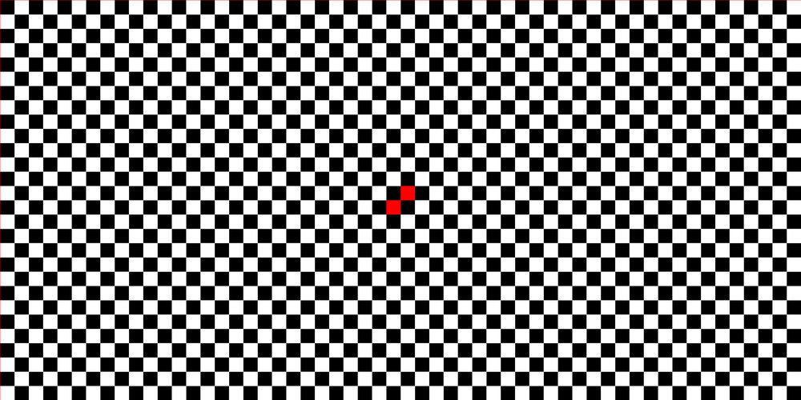
            
        - Bad
            
            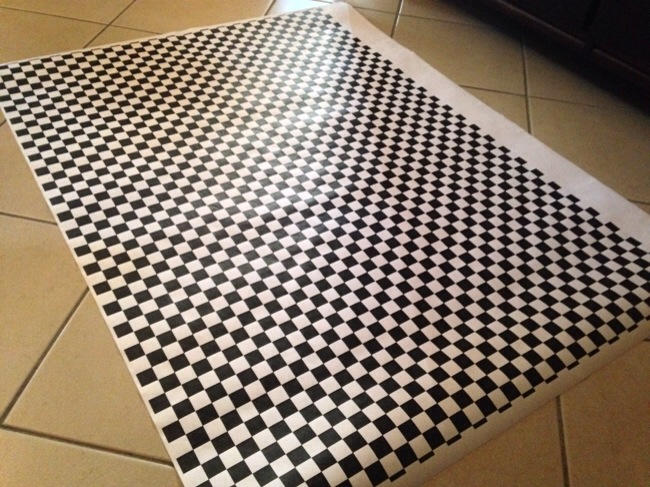 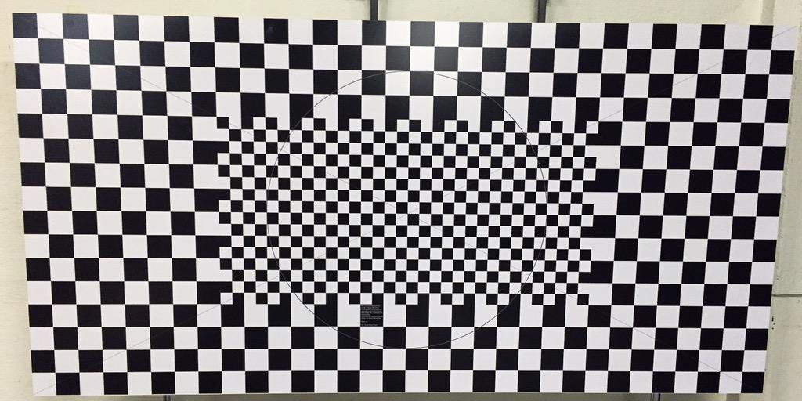 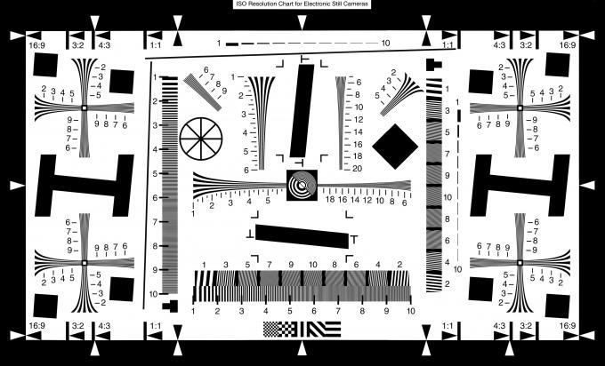
        
        - 제작
            - 평평해야 한다. 그리드 자체에 굴곡이 있으면 안된다.
            - **유광재질**은 피해야 한다.
            - 칸 하나 종횡비: 1 대 1
            
    1. Parameter Adjustment
        - Lens Distortion Grid를 솔브하는 것 만큼 정확하지는 않지만, (정확한)2D Point가 풍부하면 어느정도 신용할 수 있는 결과가 나온다.
        - 단순히 최소 애러값을 찾는 방식이기 떄문에, 전혀 엉뚱한 결과가 나오기도 한다.

---

## Example Project Info
- Camera: [Canon EOS 40D](http://web.canon.jp/imaging/eosd/eos40d/specifications.html)
- Film Back/Film Aperture Size: 22.20 × 14.77 mm
- Original Plate Image Size: 1936 × 1288 px

    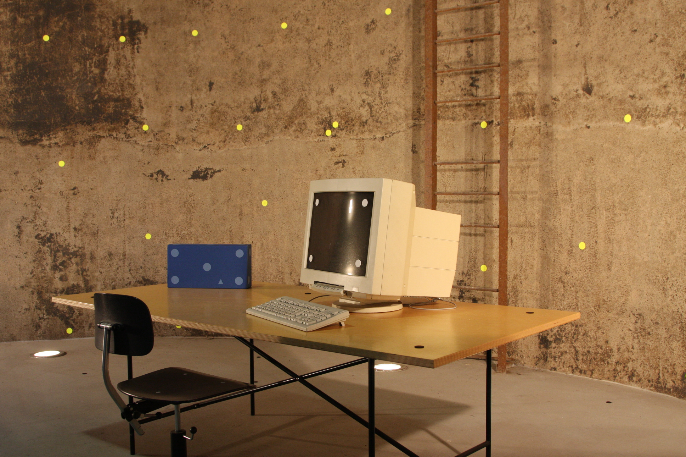
    
- Overscan Percentage Width & Height: 5%
- Undistorted/Dewarped Plate Image Size: 2033 × 1352 px
    - 1936 × 1.05 = 2032.8
    - 1288 × 1.05 = 1352.4

## 3DEqualizer
1. Export Undistorted/Dewarped Plates with Warp4

    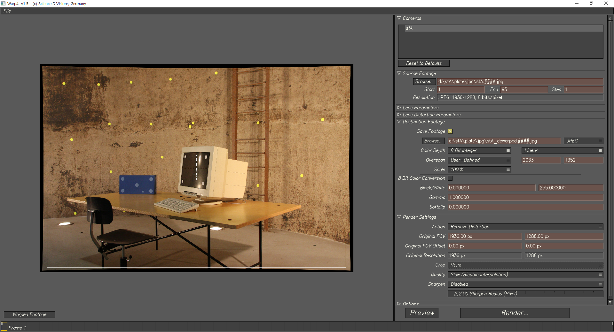
    
    - Overscan Percentage Width & Height: 5%
    - Undistorted/Dewarped Plate Image Size: 2033 × 1352 px
        - 1936 × 1.05 = 2032.8
        - 1288 × 1.05 = 1352.4
    - Warp4 GUI 버젼은 버그가 좀 있다.
1. Export Nuke LD_3DE4 Lens Distortion Node
1. Export Project to Maya

## Maya

### Setup
1. Import 3DE Project
1. Overscan Compensation
    1. Film Back/Film Aperture
    1. Image Plane

### Render
1. Render Settings
    1. Image Size: 2033 × 1352 px (Undistorted/Dewarped Plate Size)

## Nuke

### Install

### Redistort/Distort Node Tree

---

# References
- [KR100744937B1 - 렌즈 왜곡 보정 방법 - Google Patents](https://patents.google.com/patent/KR100744937B1/ko)
- [How Lenses Function](https://youtu.be/EL9J3Km6wxI)
- [How Canon EF Lenses Are Made](https://youtu.be/59BfFQuX1rg)
- [다크 프로그래머 :: 카메라 왜곡보정 - 이론 및 실제](https://darkpgmr.tistory.com/31)
- [What is Distortion? - Photography Life](https://photographylife.com/what-is-distortion)
- [Distortion | 에드몬드 옵틱스 - Edmund Optics](https://www.edmundoptics.co.kr/resources/application-notes/imaging/distortion/)
- [DIY Lens Distortion Acquisition — TRIZ VFX](http://trizvfx.com/lens-distortion-acquisition)
